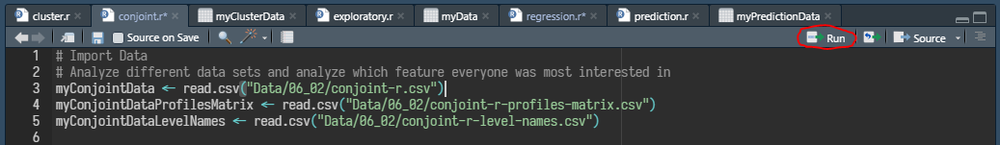

# Directions for Windows 10:

## Software Requirements:

<ul>
<li>Download and install R language (version 4.0.4 at the time of presentation) https://cran.rstudio.com/bin/windows/base/</li>
<li>Download and install RStudio for Windows (version 1.41 or above) https://rstudio.com/products/rstudio/download/#download</li>
<li>Download and install RTools for Windows https://cran.r-project.org/bin/windows/Rtools/rtools40-x86_64.exe</li>
</ul>

## Using This Project:

<ol>
<li>Clone this repository</li>
<li>Within the /DataAnalysis folder, open each .r script and run each line individually:  

</li>
</ol>